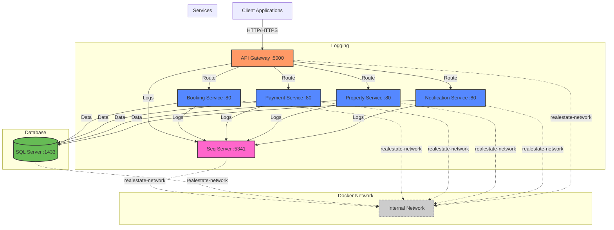
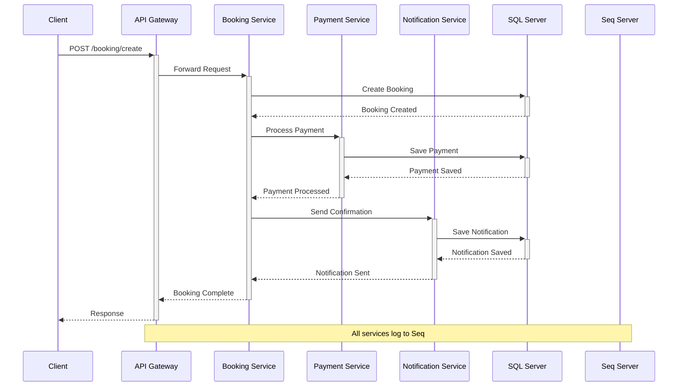

# Real Estate Microservices Project

## Architecture Overview

### System Architecture

### Request Flow

## Services

### API Gateway

- Entry point for all client requests
- Routes requests to appropriate microservices
- Handles cross-cutting concerns
- Port: 5000

### Booking Service

- Manages property bookings
- Handles booking lifecycle
- Integrates with Payment and Notification services
- Internal Port: 80

### Payment Service

- Processes payments
- Manages payment status
- Handles refunds
- Internal Port: 80

### Property Service

- Manages property listings
- Handles property search
- Manages property availability
- Internal Port: 80

### Notification Service

- Sends notifications
- Manages notification preferences
- Supports multiple channels (email, SMS)
- Internal Port: 80

## Infrastructure

### Logging (Seq)

- Centralized logging
- Real-time log aggregation
- Structured logging support
- Port: 5341

### Database

- SQL Server
- Separate databases per service
- Port: 1433

### Network

- Docker network: realestate-network
- Internal service communication
- Isolated network for security

## Getting Started

### Prerequisites

- Docker
- .NET 8.0 SDK
- SQL Server
- Seq

### Running the Project

1. Clone the repository
2. Navigate to the root directory
3. Run `docker-compose up`
4. Access the API Gateway at `http://localhost:5000`
5. Access Seq dashboard at `http://localhost:5341`

## Technologies

- .NET 8.0
- Entity Framework Core
- YARP Reverse Proxy
- Serilog
- Polly
- Docker
- SQL Server
- Seq

## Features

- Microservices Architecture
- Service Discovery
- Centralized Logging
- Resilience Patterns
- Docker Containerization
- API Gateway Pattern
- Circuit Breaker Pattern
- Structured Logging
